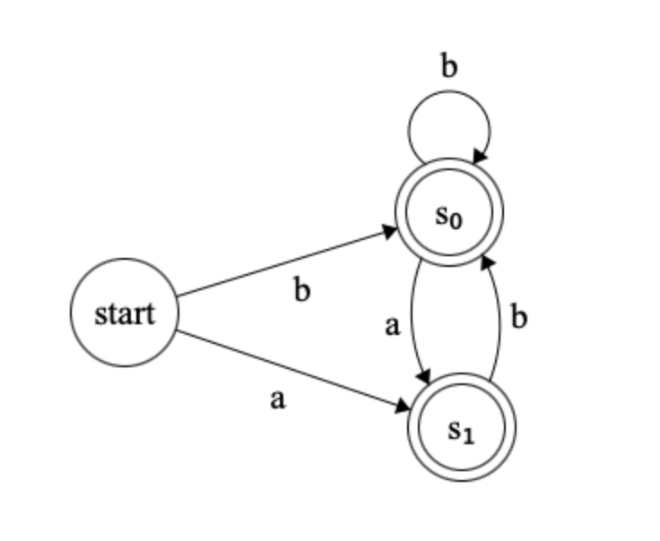

# Exercise 3.2

## Write a regular expression that recognizes all sequences consisting of a and b where two a’s are always separated by at least one b.

`^(b|ab|a$)+$`

## Construct the corresponding NFA. Try to find a DFA corresponding to the NFA.

### NFA:

#### Table:

| DFA state | move(a) | move(b) | NFA state                    |
| --------- | ------- | ------- | ---------------------------- |
| s$_{0}$   | s$_{1}$ | s$_{2}$ | {0, 1, 3, 6}                 |
| s$_{1}$   | {}      | s$_{2}$ | {2, <ins>4<ins>}             |
| s$_{2}$   | s$_{1}$ | s$_{2}$ | {5, <ins>7<ins>, 0, 1, 3, 6} |

### DFA:

